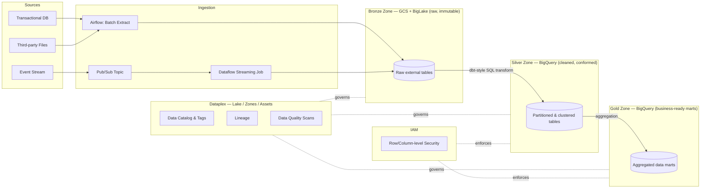

# Architecture

## 1. Overview

This lakehouse follows a **medallion architecture** (Bronze → Silver → Gold) implemented natively on GCP, with governance and cataloging enforced at every layer via Dataplex rather than applied retroactively.

## 2. Layer-by-layer design

### Bronze (raw)
- **Storage:** GCS buckets (`raw/<source>/<ingestion_date>/`), registered as BigLake external tables so BigQuery can query raw files without a load step.
- **Format:** Parquet (batch sources), Avro (streaming sources) — both natively supported by BigLake with predicate pushdown.
- **Immutability:** Bronze is append-only. No updates or deletes — corrections happen downstream in Silver. This preserves full lineage back to source and lets us replay transformations if business logic changes.
- **Partitioning:** Hive-style partitioning by ingestion date (`/yyyy/mm/dd/`) so BigLake can prune partitions without scanning the full bucket.

### Silver (cleaned & conformed)
- **Storage:** Native BigQuery tables (not external) — once data is cleaned, we want BigQuery's native storage for performance (clustering, storage optimization) rather than the flexibility trade-off of external tables.
- **Transformations:** deduplication, schema conformance, type casting, null handling, slowly-changing-dimension logic where relevant. See [`pipelines/sql/bronze_to_silver.sql`](../pipelines/sql/bronze_to_silver.sql).
- **Partitioning & clustering:** partitioned by event/business date, clustered by the highest-cardinality filter column (e.g. `customer_id`, `device_id`) based on expected query patterns — see per-table rationale in section 4.

### Gold (business-ready)
- **Storage:** Native BigQuery tables, materialized as aggregated marts per consuming domain (e.g. `gold.customer_360`, `gold.daily_revenue_summary`).
- **Access pattern:** this is the only layer most BI tools and business users should query directly. Silver and Bronze are governed but not broadly exposed.

## 3. Ingestion patterns

### Batch
Airflow DAG (`pipelines/airflow/dags/batch_ingestion_dag.py`) runs on a schedule, extracts from source systems, lands files in GCS Bronze, then triggers the Bronze→Silver→Gold SQL transformation chain as BigQuery jobs. Retries and SLA alerts are configured per task.

### Streaming
Pub/Sub topic receives events in near-real-time; a Dataflow streaming job (referenced in `pipelines/airflow/dags/streaming_ingestion_dag.py` as the orchestration/monitoring layer) writes micro-batches into the same Bronze GCS layout, so downstream Silver/Gold transforms are ingestion-pattern-agnostic — they don't know or care whether a given Bronze record arrived via batch or streaming.

**Trade-off note:** we chose Pub/Sub → Dataflow → GCS (landing in Bronze) rather than Pub/Sub → BigQuery direct-streaming-insert, because it keeps a single unified Bronze layer (queryable, replayable, cheap storage) instead of splitting raw data across two different storage paradigms. The cost is slightly higher latency to Silver (micro-batch vs. true row-by-row); we judged this acceptable since none of the target use cases need sub-second freshness in Gold.

## 4. Partitioning & clustering rationale (sample tables)

| Table | Partition | Cluster | Rationale |
|---|---|---|---|
| `silver.transactions` | `DATE(transaction_ts)` | `customer_id, merchant_id` | Most queries filter by date range + customer; clustering on both cuts scan cost significantly for customer-level lookups. |
| `silver.device_telemetry` | `DATE(event_ts)` | `device_id` | High-cardinality device_id as cluster key optimizes the common "device history" query pattern. |
| `gold.daily_revenue_summary` | `revenue_date` | `region` | Small, pre-aggregated table; partition pruning alone is sufficient. |

## 5. Governance & cataloging (Dataplex)

- **Lake/Zone structure:** one Dataplex Lake per domain, with `raw`, `curated`, and `analytics` zones mapping to Bronze/Silver/Gold.
- **Auto-discovery:** Dataplex asset discovery is enabled on the Bronze GCS buckets so new partitions are catalogued automatically without manual registration.
- **Tagging:** business glossary tags (PII classification, data owner, retention policy) applied at the table level via Data Catalog, enforced through Terraform (`terraform/dataplex.tf`).
- **Lineage:** Dataplex's automatic lineage tracking (BigQuery job-level lineage) is enabled, supplemented by a manual lineage doc per Gold table for lineage that crosses non-BigQuery boundaries (e.g. an external ML feature store).
- **Data quality scans:** Dataplex Data Quality tasks run against Silver and Gold tables on a schedule; failures alert via the same channel as pipeline SLA failures. See [`governance/dataplex_data_quality.yaml`](../governance/dataplex_data_quality.yaml).

## 6. Access control

- **IAM at the dataset level** for coarse-grained access (e.g. `analytics-readers` group gets `bigquery.dataViewer` on Gold datasets only, never Silver/Bronze).
- **Row-level security** on `gold.customer_360` restricting rows by region for regional business users, defined in `governance/access_control_policy.md`.
- **Column-level security / policy tags** on PII columns (email, phone, government ID) via Data Catalog policy tags, so even users with dataset access can't see raw PII without an explicit additional grant.

## 7. Key trade-offs & alternatives considered

- **BigLake vs. loading everything into BigQuery native storage immediately:** chose BigLake for Bronze specifically to avoid paying BigQuery storage costs on raw, mostly-write-once data, while still getting SQL query access for debugging/backfill scenarios.
- **Dataflow vs. Dataproc for streaming:** chose Dataflow (fully managed, autoscaling) over Dataproc (self-managed Spark clusters) to reduce operational overhead — appropriate given the team is optimizing for architecture velocity over infrastructure control at this stage. Dataproc would be reconsidered if the team already had deep Spark tuning expertise in-house and wanted tighter cost control at very high volumes.
- **Airflow vs. Cloud Composer vs. Workflows:** DAGs are written to be Cloud-Composer-compatible (managed Airflow) rather than raw self-hosted Airflow, trading a bit of cost for significantly less operational burden — consistent with the "balance strategic architecture with hands-on delivery" expectation of the role, rather than over-engineering infra ops.
